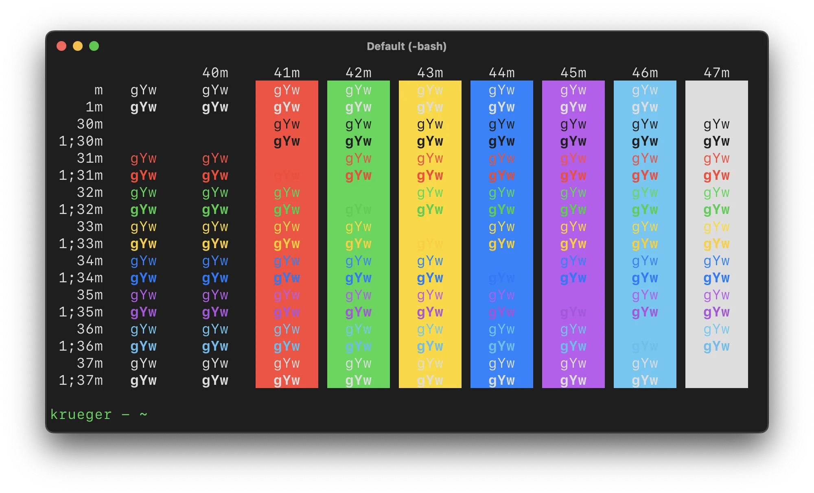

# Colors of Cupertino

These themes are based on the colors set out in Apple's [Human Interface Guidelines](https://developer.apple.com/design/human-interface-guidelines/foundations/color). Themes are updated as the HIG reference colors are updated.

The colors are defined by the HIG with the following hex and RGB values:

- Standard Text: (221, 221, 221), #DDDDDD
- Background: (30, 30, 30), #1E1E1E
- Blue: (10, 132, 255), #0A84FF
- Cyan: (90, 200, 245), #5AC8F5
- Green: (50, 215, 75),  #32D74B
- Purple: (191, 90, 242), #BF5AF2
- Red: (255, 69, 58), #FF453A
- Yellow: (255, 214, 10), #FFD60A

## Midnight in Cupertino for iTerm2

### Installation

1. Open Preferences by pressing **⌘-comma**.
2. Click **Profiles** from the top options.
3. Click **Colors** from the secondary options.
4. From the **Color Presets** dropdown on the bottom-right, click **Import**.
5. Select the **midnight-in-cupertino-iterm2.itermcolors** file from the directory you downloaded it to.
